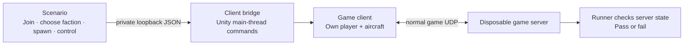

# NOTestPilot

**A programmable test player for Nuclear Option.**

Start a disposable server, connect separate game clients, tell them what to do,
and check what the server actually saw. Useful for catching broken server mods
without clicking through the same setup every time.

An early working prototype, independent of [NOPerf](https://github.com/clankagent/noperf).
It uses the dedicated-server build's client code over direct UDP. It does not yet
replace testing with retail Steam clients and people playing a long session.

## What works today

Verified on Linux, Nuclear Option **0.34.1 / Steam build 24724541**:

| Test | Result |
|---|---|
| Join → disconnect → reconnect | Passed with a separate client process |
| Two players join Escalation | Passed; each client's player ID matches the server |
| Choose opposing factions | Passed; confirmed on the server |
| Reserve and spawn two aircraft | Passed; server aircraft IDs match the owning clients |
| Start engines and hold controls | Passed; the server receives distinct throttle values |
| Two owned aircraft move in Escalation | One pass (178 m / 44 m); repeat lost the second aircraft — fixture needs work |
| Flight, firing, death and respawn | Not verified |
| Steam authentication, retail clients, dedicated-server rotation | Not verified |
| Long multiplayer sessions / performance-mod comparison | Not verified |

The runner also has **21 automated tests**. These protect the testing tool;
they do not count as game tests. See [the evidence summary](evidence/status.json).

## How the player works

It is a separate game process using the game's network. The bridge replaces the
person clicking and moving a joystick. The server handles player requests and the
game runs the aircraft simulation.



A command being accepted is not enough. The test waits for the resulting player,
aircraft or control value on the server. It fails on missing outcomes, crashes,
unexpected game errors or timeouts.

## How you control it

A scenario is a sequence of commands and checks. This commands the first client:

```json
{
  "target": "client1",
  "command": "controls",
  "args": { "throttle": 0.7, "brake": 0, "pitch": 0, "seconds": 35 }
}
```

The controls expire after 35 seconds. Pitch, roll and yaw range from −1 to +1;
throttle and brake from 0 to 1. Expiry and cleared server inputs are verified. Another command replaces the controls;
`release-controls` ends the override immediately.

Edit a scenario or drive the same bridge from Python. The controller supplies raw
control values; it does not yet plan routes or fly intelligently.
See [commands and protocol](docs/control.md).

## Run a test

Use a separate Linux lab with clean game inputs and the bridge installed.
[Setup instructions](docs/development.md) cover that first step.

```sh
uv run notestpilot scenarios/two-player-aircraft.json \
  --game /path/to/clean-game-input \
  --lab /path/to/disposable-lab \
  --output /path/to/private-results \
  --execute
```

The runner makes one game copy per process, starts the server and clients, executes
the scenario, writes JSON and JUnit XML, and stops its child processes. It refuses
existing unmarked folders. Game runs require the explicit `--execute` flag.

Run only the tool's unit tests, without installing the game:

```sh
uv run python -m unittest discover -s tests -v
```

## What remains unproven

Two controlled aircraft are a useful start, but short functional checks do not
establish performance with many players flying and fighting for an hour. Large
missions, sustained player actions and repeated baseline-versus-mod runs are
needed before capacity or speedup claims.

Clients and server currently share the lab VM. Combined resource use must not be
presented as the server's production requirement.

The headless clients need a small UDP adapter because this build normally tries
retail Steam callbacks even for UDP. The server's normal UDP password, build and
join checks remain in use. No Steam identities are fabricated. Steam login and
unmodded retail-client compatibility remain separate tests.

- [How commands reach the game](docs/control.md)
- [What passes and failures mean](docs/testing.md)
- [Build and remote-lab setup](docs/development.md)

No game binaries or decompiled source are included. Unofficial; not affiliated
with Shockfront Studios. Use the bridge only in disposable test processes. It is
disabled by default and its control socket binds to loopback.
