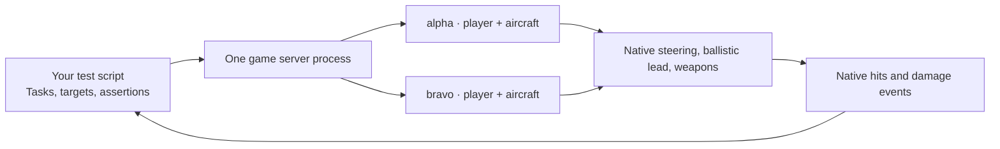

# NOTestPilot — programmable server tests

Script repeatable Nuclear Option tests with multiple native test players in one
game process. Direct aircraft tasks or submit player requests, observe native
effects, and assert what happened.

Choose **Server simulation** for scripted flight, weapons and lifecycle tests,
or **Player requests** for native authentication, joining, purchases and validated
airbase spawning. Both run in one disposable game process with separate APIs.

## Testing modes

| Mode | Status | Purpose |
|---|---|---|
| Server simulation | Available; measured game scenarios pass | Script native aircraft, combat and lifecycle behavior in one game process |
| Player requests | Implemented; native request and guard checks pass | Exercise non-Steam authentication, ordinary allowance, purchases, ownership and validated airbase spawning |

A normal remote player simulates flight on their client and sends snapshots;
Server simulation instead flies the mock aircraft on the server. Its native
impacts also bypass the remote client's hit-claim validation. Authentication,
normal joining funds, aircraft purchase/reservation and saved-player data are
outside Server simulation coverage. Player requests exercises the native entry
and request checks, while socket delivery and client-owned flight remain untested.

Server simulation retains native ammunition, firing cadence, impacts and damage. This is a
deliberate simulation test tool, not an equivalent number of connected players.
See [the mode comparison](docs/testing-modes.md) for the precise shared behavior,
bypasses and request coverage. Use `Session.create()` for Server simulation or
`Session.join_request_player()` for Player requests.

This branch is a new orphan history. The previous headless-client implementation
is preserved on `main`.

## Development status

The first remote game checks pass: two independent mock players and aircraft in
one process, separate navigation including a physical turn, cancellation,
stale-handle rejection, and explicit-target gunfire with native hits and attributed
applied damage. Ejection, replacement and reusing a retired player's name also
pass. This remains development tooling with limited scenario coverage.

Two-actor and four-actor scenarios also passed five minutes of repeated measured waypoint turns and
cancellation isolation, with native identity and control ownership checked
throughout. That airborne fixture is still narrower than a full mission.

A separate session also passed five minutes of navigation followed by exact-target
gunfire, cancellation and a measured turn when the same aircraft resumed flying.
A second pilot continued independently through those task changes.

Server simulation mocks do not establish authentication. Separate Player requests
checks passed native non-Steam authentication, allowance, rejected unaffordable
purchases, exact-cost inventory credit, rejected unowned/foreign-base spawning
and a connection-owned aircraft retaining remote simulation. A two-peer guard
fixture also passed wrong-owner rejection, native rate limiting and refill,
independent sender state and disconnect cleanup. The public two-player purchase
and spawn example also passed in three fresh missions, including identity and
economy isolation and exact-owned disconnect cleanup. See the
[measured request checks](docs/runtime-checks.md#native-player-requests-checks).

Neither mode establishes socket delivery or retail Steam coverage. Longer
missions, other aircraft and weapons, mission
changes and larger actor counts remain to be tested. No capacity or resource
saving claim is made from these short checks.

The game runs only in a disposable remote lab. Proprietary assemblies and private
results are local inputs, never repository contents.

## What a script controls

In Server simulation, each named pilot has a native game `Player` record and its
own aircraft. A script chooses the destination, exact target and weapon station. The adapter borrows the
game's steering and ballistic calculations and calls the normal firing path.
The ordinary autonomous NPC brain is never assigned to these pilots.



These are server-side mock players without network connections. This architecture
tests server game behavior; it does not exercise a retail client's login,
transport or rendering. The previous network-client approach remains on `main`.

## Write a Server simulation task

The Python package has no runtime dependencies. Use `uv sync`, then provide the
private control port and token through `NOTESTPILOT_PORT` and `NOTESTPILOT_TOKEN`.
The control endpoint listens on loopback in the game lab.

```python
from notestpilot import Session

session = Session()  # an already running disposable mission
state = session.status()
base = next(b for b in state["airbases"] if b["faction"] in state["factions"])
x, y, z = base["position"]

pilot = session.create("alpha", base["faction"])
pilot = pilot.spawn(type="COIN", position=(x, y + 1500, z), velocity=(0, 0, 110))
pilot.goto((x, y + 1500, z + 15000), speed=110)
# Read pilot.status() to assert progress; cancel or issue a new task explicitly.
pilot.cancel()
pilot.remove()
```

For two independent tasks using observed mission positions:

```sh
uv run notestpilot status
uv run notestpilot two-actors --type COIN --seconds 5
```

The example requires an already running disposable mission. It removes its own
actors afterwards and reports cleanup failures. It is a navigation demonstration,
not a combat or arrival test.

For a test that asserts real weapon effects:

```sh
uv run python examples/explicit_target.py
```

That script creates two opposing mock players in an airborne fixture, waits for
native tracking, then directs one exact gun station against the named aircraft.
It passes only after observing a native bullet, a hit on that aircraft and
positive native applied damage attributed to the shooter. It removes its own
actors on success or failure. It leaves the mission and unrelated actors alone.
The optional `--allow-headless-texture-error` flag permits one exact rendering
error with a complete error journal; all other errors still fail.

The lifecycle regression script checks independent navigation, ejection,
replacement, stale-handle rejection and cleanup:

```sh
uv run python examples/lifecycle.py
```

Both scripts produce a JSON result, exit unsuccessfully on failed assertions and
keep cleanup failures visible. Their airborne fixtures exercise particular
server mechanics, not a prolonged multiplayer session.

For repeated navigation tasks in one session:

```sh
uv run python examples/sustained_tasks.py --duration-seconds 300
```

This script assigns two separated airborne pilots new waypoints every 30 seconds.
Each phase requires measured movement and a turn toward the assigned direction,
as well as the expected native identities, server simulation and task state.
It checks cancellation isolation and cleans only its own actors. JSON diagnostics
include phase timings, heading response and observed speed/altitude ranges.
Durations below five minutes are labelled smoke tests. Consult the runtime checks
for which durations and scenarios have actually passed against the game.
The actor count can range from 2 to 4 and the turn angle from 10° to 35°:

```sh
uv run python examples/sustained_tasks.py --actors 4 --turn-degrees 15
```

The script requires every remaining actor to progress when it cancels the first actor.

To exercise different tasks on the same player and aircraft:

```sh
uv run python examples/task_transitions.py
```

The script first observes a minute of navigation, creates an opposing airborne
target ahead of the pilot's measured position, and commands an exact gun station.
It requires native bullets, a hit and attributed applied damage. After cancellation,
it checks a three-second window for new shooter bullets, then requires a physical
turn when that same aircraft resumes navigation. A friendly pilot keeps flying
throughout. Existing projectiles may still hit after firing stops.
Use `--navigation-seconds 300` to put the combat transition after five minutes of
flight. Every stage has a deadline and reports the observed task and evidence on
failure; the script removes only actors it created.

Useful script operations:

| Operation | Purpose |
|---|---|
| `pilot.goto(destination, speed)` | Assign that pilot an explicit navigation task |
| `session.units(faction=..., name_contains=...)` | Inspect native units before choosing a target |
| `pilot.inspect_target(target_id)` | Check the pilot's native HQ tracking of a particular target |
| `pilot.attack(target_id, station, seconds)` | Attack one exact unit using an armed fixed gun |
| `session.events()` | Read sequenced native fire, hit and damage observations |
| `session.wait_for(predicate, description, timeout=...)` | Wait for a stated condition with a bounded deadline and last-state diagnostics |
| `pilot.cancel()` / `pilot.remove()` | Stop the task / retire that mock player and aircraft |

Attack currently requires a live opposing target with accurate native HQ tracking.
It does not invent visibility or apply artificial damage. A fire request is not a
hit: tests should assert native hit and attributed applied-damage events separately.
These assertions cover the server impact/damage path, not remote-client hit claims.

Actor handles bind the server instance, player identity and aircraft generation.
Old handles cannot silently control replacements. Commands are never retried
automatically; inspect state after a transport failure before deciding what to do.
Lost events and observer errors invalidate evidence.

See [the architecture](docs/architecture.md) for the control and lifecycle paths,
and [runtime checks](docs/runtime-checks.md) for what has actually passed.

## Test Player requests

Enable `NOTESTPILOT_PLAYER_REQUESTS=1` on the disposable game process before
starting its mission. Supply the Python script's `NOTESTPILOT_PASSWORD` explicitly
with the same configured lab password; keep `NOTESTPILOT_PORT` and
`NOTESTPILOT_TOKEN` for the private control connection.

```sh
uv run python examples/player_requests.py
```

The example joins two native non-host players, checks ordinary allowances and
independent purchases, then requires each spawn's correlated native reply and
actual connection-owned aircraft. It verifies remote simulation and cleans only
its own connections on success or failure. The complete example and the separate
request rejection/guard paths have passed real game checks.

| Request API | Purpose |
|---|---|
| `session.join_request_player(name, password)` | Authenticate once and wait for native readiness |
| `player.join_faction(faction)` | Request normal faction entry and allowance |
| `player.purchase_airframe(key)` | Request a purchase using ordinary allocation |
| `player.request_spawn(airbase, key)` | Request validated native spawning; returns a current handle |
| `player.status()` | Inspect inventory, ownership and correlated spawn outcomes |
| `player.packets()` | Consume one bounded chunk of copied native outgoing messages |
| `player.disconnect()` | Run native connection and owned-object cleanup |

An allowed spawn reply may precede the aircraft. Assert both the exact receipt
and the linked aircraft, then explicitly rebind after its generation changes.
Request players have no free-position spawn, `goto()` or server attack capability.
After an uncertain join, use `recover_request_player()` only to inspect the exact
creation receipt and clean up; never retry a purchase or spawn automatically.
Packet drains consume diagnostics: keep raw bytes private, and drain through a
captured sent-sequence boundary rather than waiting for a continuously producing
connection to become empty. Lost drain responses or sequence gaps invalidate
packet evidence.

## Build and check

The runtime requires BepInEx 5 and the reviewed dedicated-server game assemblies.
It refuses other game builds. Supply paths to your own inputs:

```sh
dotnet build src/NOTestPilot.Runtime -c Release -p:ManagedPath=/path/to/NuclearOptionServer_Data/Managed -p:BepInExCore=/path/to/BepInEx/core
uv run python -m unittest discover -s tests -v
```

On Windows, the extra reflection check validates the actual Harmony argument
bindings against your supplied build, rather than relying on compilation alone:

```powershell
./tests/check_hook_bindings.ps1 -ManagedPath /path/to/Managed -BepInExCorePath /path/to/BepInEx/core
```

In a disposable server copy, install the built runtime DLL in `BepInEx/plugins`,
set `NOTESTPILOT_ENABLE=1`, the private token (at least 32 characters) and control
port. Set `[Chainloader] HideManagerGameObject = true` in the BepInEx configuration.
Enable the loader using its normal launch instructions. Do not install this test
adapter on a production server.

For the headless dedicated build, also set `NOTESTPILOT_LOCAL_HOST_ADAPTER=1`.
This registers the native password handlers for the process's internal local
host connection; server authentication checks still run. Once `status.menuReady`
is true, `session.host("Escalation")` starts the lab mission.

The supported `Assembly-CSharp.dll` SHA-256 is
`df5bed594dd84912efb3e57faa75b37d7e327bf4c8f5418f50411ad0ff46e24a`.
The Python tests check real loopback transport, identity guards, event integrity
and waits. They do not establish a game runtime pass.
