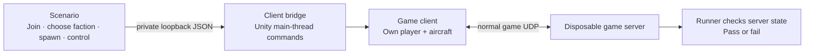

# NOTestPilot

**A programmable test player for Nuclear Option.**

Start a disposable server, connect separate game clients, tell them what to do,
and check what the server actually saw. Useful for catching broken server mods
without clicking through the same setup every time.

An early working prototype, independent of [NOPerf](https://github.com/clankagent/noperf).
It uses the dedicated-server build's client code over direct UDP. It does not yet
replace testing with retail Steam clients and people playing a long session.

## What works today

Verified on Linux, Nuclear Option **0.34.1 / Steam build 24724541**:

| Test | Result |
|---|---|
| Join → disconnect → reconnect | Passed with a separate client process |
| Two players join Escalation | Passed; each client's player ID matches the server |
| Choose opposing factions | Passed; confirmed on the server |
| Reserve and spawn two aircraft | Passed; server aircraft IDs match the owning clients |
| Start engines and hold controls | Passed; the server receives distinct throttle values |
| Two owned aircraft move in Escalation | One pass (178 m / 44 m); repeat lost the second aircraft — fixture needs work |
| Two-client taxi → takeoff → flight circuits | Passed in a UDP host and again through the native dedicated-server manager; three minutes per script |
| Native dedicated-server startup | Passed: hidden server waits for players; the first join loads stock Escalation; both clients join |
| Damage → pilot death → ejection / recovery | Observed in a failed movement test; both players stayed connected |
| Parked ejection → recovery → respawn | Passed for both clients; original player IDs retained |
| Airborne ejection → replacement → second flight | Passed for both clients on the native dedicated server: new aircraft, same players, both airborne again |
| Repeated two-sortie lifecycle | Two consecutive passes, 51 checks each: flight, rockets, airborne ejection, replacement and flight again |
| Three sorties → six minutes of gun firing → reconnects | Flight, replacement and firing checks passed; the second client's disconnect failed with a missile-warning display exception |
| Gun firing | Both clients consumed their 1,000-round gun ammunition; server confirmed |
| Select and fire rockets | Passed on the native dedicated server; both clients' rocket ammunition went from 8 to 0 |
| Brief gun bursts while flight continues | Passed 54 checks: three bursts per client, server ammunition decreases, then stays unchanged between bursts |
| Four-player ten-minute flight | Three independent baselines and one matched Spatial run passed 50 checks each: all four stayed airborne, fired and retained their aircraft. Earlier failures preserved |
| Fifteen-minute flight and firing | Failed after about ten minutes airborne: one pilot died from collision damage. Both stayed connected |
| Dedicated-server mission rotation | Failed during ship-effect cleanup and, in a separate occupied run, turret cleanup; both retained |
| Steam authentication / retail clients | Not tested |
| Performance-mod comparison | One complete baseline/Spatial pair; no whole-server gain established. Earlier failures retained |
| Five-sortie aging workload | Four full sorties completed. An enemy missile interrupted the fifth; its remaining firing checks were skipped and recorded |
| Automatic reaction to missile damage | One live pass verified missile damage triggered normal ejection and replacement, with the same players receiving new aircraft. Repeated recovery remains unverified |
| Long multiplayer sessions | Not verified |

The runner also has **49 automated tests** (all pass on Linux; 48 pass on Windows
with the POSIX signal test skipped). These protect the testing tool;
they do not count as game tests. See [the evidence summary](evidence/status.json).

The [interactive resource report](https://clankagent.github.io/noperf/resource-report.html)
shows what the newer Ryzen lab used, with separate server/client charts and a
step-by-step explanation of shared CPU use. It explains why these measurements
are not yet a production-capacity recommendation.

## How the player works

It is a separate game process using the game's network. The bridge replaces the
person clicking and moving a joystick. The server handles player requests and the
game runs the aircraft simulation.



A command being accepted is not enough. The test waits for the resulting player,
aircraft or control value on the server. It fails on missing outcomes, crashes,
unexpected game errors or timeouts.

## How you control it

A scenario is a sequence of commands and checks. This commands the first client:

```json
{
  "target": "client1",
  "command": "controls",
  "args": { "throttle": 0.7, "brake": 0, "pitch": 0, "seconds": 35 }
}
```

The controls expire after 35 seconds. Pitch, roll and yaw range from −1 to +1;
throttle and brake from 0 to 1. Expiry and cleared server inputs are verified. Another command replaces the controls;
`release-controls` ends the override immediately.

Edit a scenario or drive the same bridge from Python. Raw controls are available, and an experimental `fly` command steers toward a runway,
attempts takeoff, then follows a simple circuit. It still needs reliable repeated
game tests; it is not a combat pilot.
See [commands and protocol](docs/control.md).

The workload generator also lets you choose one through four pilots and how long
they should stay airborne, producing the commands and checks for every player.
See [the generator example](docs/control.md#a-longer-action-script). The revised four-pilot ten-minute flight/firing script passed. Its earlier
empty-ammunition failure remains recorded.
Longer play, repeated combat recovery and reliable repeated scenarios still need validation.

## Run a test

Use a separate Linux lab with clean game inputs and the bridge installed.
[Setup instructions](docs/development.md) cover that first step.

```sh
uv run notestpilot scenarios/native-startup-flight.json \
  --game /path/to/clean-game-input \
  --lab /path/to/disposable-lab \
  --output /path/to/private-results \
  --execute
```

The runner makes one game copy per process, starts the server and clients, executes
the scenario, writes JSON and JUnit XML, and stops its child processes. It also saves
a live progress file and a timeline so a long run can be inspected while it runs.
Each process has separate CPU and frame counters; reports use observation-window
deltas to exclude loading time. It refuses
existing unmarked folders. Game runs require the explicit `--execute` flag.

Run only the tool's unit tests, without installing the game:

```sh
uv run python -m unittest discover -s tests -v
```

## What remains unproven

Two controlled aircraft are a useful start, but short functional checks do not
establish performance with many players flying and fighting for an hour. Large
missions, sustained player actions and repeated baseline-versus-mod runs are
needed before capacity or speedup claims.

Clients and server currently share the lab VM. Combined resource use must not be
presented as the server's production requirement.

For mod comparisons, run the same scenarios separately with and without the mod.
The flight controller responds to each aircraft's state; matching tasks and
outcomes are more useful than replaying identical inputs. Repeat in alternating
order. Both variants currently need the test bridge on the server, so the baseline
is **without the performance mod**, rather than a completely stock installation.
A server with no BepInEx or bridge needs a separate launch and observation path.

The headless clients need a small UDP adapter because this build normally tries
retail Steam callbacks even for UDP. The server's normal UDP password, build and
join checks remain in use. No Steam identities are fabricated. Steam login and
unmodded retail-client compatibility remain separate tests. A scene-owned camera
also supplies the empty waiting scene's view dependency; it renders nothing and
leaves the original network update running.

- [How commands reach the game](docs/control.md)
- [What passes and failures mean](docs/testing.md)
- [Build and remote-lab setup](docs/development.md)

No game binaries or decompiled source are included. Unofficial; not affiliated
with Shockfront Studios. Use the bridge only in disposable test processes. It is
disabled by default and its control socket binds to loopback.
