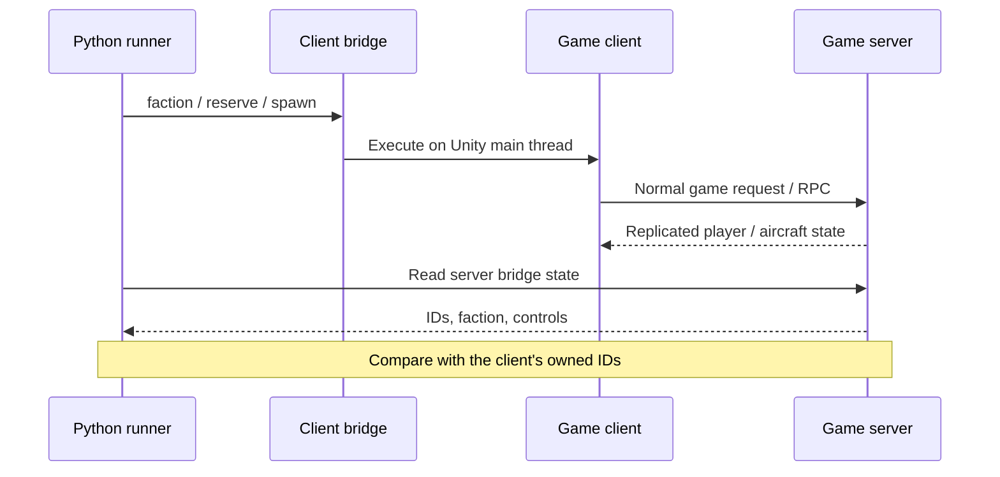

# How to control a test player

**Tell the client what to do. Ask the server whether it happened.**

Each client is a separate Nuclear Option process. A BepInEx 5 plugin provides a
local control interface. Python sends commands there and polls the server's bridge
for the resulting state.



The socket worker parses requests; game methods run on Unity's main thread. Each
request has an ID, token and execution deadline. The runner creates a fresh random
token for each run. This token is separate from the game server password.

An experimental recovery workload can react to a verified missile strike. If
flight checks fail, it requires recent server evidence of an external missile,
destructive part damage and the same damage replicated to the owning client.
It then follows the scenario's ordinary ejection, reserve and spawn steps. An
unexplained loss, game error, disconnect or mission failure still stops the run.

The interrupted flight is recorded as partial. Remaining weapon checks are listed
as omitted, rather than reported as completed. This branch has automated runner
coverage and one native run confirmed normal ejection and replacement after a
verified missile-loss interruption at 58.03 of a 60-second airborne check. The
fifth-sortie gun-flight and rocket checks were omitted; repeated recovery and a
completed five-sortie survival run remain unverified. See
`scenarios/native-combat-recovery.json`; the strict survival fixture stays separate.

Two scoped adapters allow headless UDP connections without retail Steam callbacks
and provide a fallback display name. The server's original authenticator still
checks the join. This does not test Steam authentication or retail-client compatibility.

## Commands

| Command | Target | Arguments / effect |
|---|---|---|
| `status` | Either | Read mission, IDs, aircraft, controls and game errors |
| `host` | Server | `mission`, `port`, optional `password`; UDP multiplayer host |
| `dedicated` | Server | `missions` array, `port`, optional `password`; original dedicated manager, hidden UDP server |
| `rotate` | Server | Expire the native mission's time limit through the normal admin operation; currently exposes a stock cleanup failure |
| `connect` | Client | `port`, optional `password`; join loopback host |
| `disconnect` | Client | Normal game network stop |
| `faction` | Client | `name`; request faction selection |
| `reserve` | Client | Optional `aircraft` key; request eligible reserve airframe |
| `purchase` | Client | `aircraft` key; request purchase (**unverified at runtime**) |
| `spawn` | Client | Optional `aircraft`, `airbase`, `fuel`; owned aircraft; game default loadout unless explicitly specified |
| `engine` | Client | `on`; request ignition toggle if needed |
| `controls` | Client | `pitch`, `roll`, `yaw`, `throttle`, `brake`, `seconds`, optional `fire` |
| `release-controls` | Client | End input override |
| `fly` | Client | `seconds`, optional `fire`; experimental taxi, takeoff, climb and square circuit |
| `catalog` | Either | Aircraft keys, compatible hardpoints and available standard loadouts |
| `eject` | Client | Normal ejection; parked recovery and airborne replacement/second flight passed for two clients |
| `gear` | Client | `down`; normal gear operation |
| `next-weapon` | Client | Cycle normal weapon selection; rocket selection and firing passed for two clients |

Default reserve selection is deterministic: eligible rank, then aircraft key.
Default spawn chooses an owned airframe and a friendly compatible base. Game
availability and ownership checks still apply. A command reply is not proof of success.

## Aircraft controls

During an active control lease, the bridge replaces the local pilot state's
keyboard/joystick reading with supplied raw values. Input filtering, pilot
simulation, physics and network snapshots keep running. The runner never directly
moves or teleports the aircraft.

Pitch/roll/yaw range from −1 to +1. Throttle/brake range from 0 to 1. Leases last
0.1–60 seconds and target one owned aircraft. Omitted controls are zero: every
command supplies a complete set. Long scripts must renew leases deliberately.

Optional `fireSeconds` limits a firing burst while the longer control or flight
lease continues. It requires `fire: true` and must be between 0.1 seconds and the
lease duration. Omitting it retains continuous firing for the lease. Status
reports `fireRequested` and `fireSecondsRemaining`; these describe the requested
trigger, not proof that a weapon fired. Verify ammunition on the server. The
native two-client burst test passed three one-second bursts, with server checks
that ammunition decreased and then stayed unchanged while flight continued.

Expiry/release clears the supplied controls and returns to normal input sampling.
If the aircraft disappears, the override stops applying. Lease status reports the
aircraft ID, remaining time and how many times the pilot applied the values.

Replacing input reading also bypasses that layer's UI and pilot-strength gates.
This is a test driver, not a keyboard/menu test or an exact simulation of human
input limitations. Flight and combat need their own runtime scenarios.

## Check the resulting ownership

```json
{
  "target": "server",
  "expect": [
    { "path": "remotePlayers", "equals": 2 },
    {
      "path": "players.1.aircraftNetId",
      "equalsFrom": { "target": "client1", "path": "localPlayerAircraftNetId" }
    }
  ],
  "timeout": 60
}
```

Snapshots sort players by player index. Included scenarios join in a known order.
The UDP host appears in this list, so its clients start at `players.1`. A native
dedicated server has no playable host entry: its clients start at `players.0`.
For reconnects, use `playerNetIds` with a `containsFrom` reference to the client's
`localPlayerNetId`. This checks the actual rejoined player without assuming its
position in the sorted list. Selecting an arbitrary aircraft by ID remains future work.

Respawn tests save a server snapshot with `"capture": "before"` on an expectation
step. Later `equalsSaved` checks require the same player ID, while `notEqualsSaved`
requires a different, non-null aircraft ID. A disappearing aircraft cannot satisfy
the replacement check. The test also matches the new aircraft to its owning client.

## Python control

A custom controller can use the runner's interface:

```python
from notestpilot.runner import Bridge

client = Bridge(port=bridge_port, token=run_token)
client.call("controls", {"throttle": 0.7, "brake": 0, "seconds": 10})
state = client.status()
client.call("release-controls")
```

The port/token belong to an explicitly enabled disposable game process. The current
CLI executes whole scenarios and closes its processes afterward. The experimental flight script uses this same interface. An interactive dashboard
is not implemented.

## A longer action script

For a repeatable player-count workload, generate a scenario instead of duplicating
every player's instructions by hand:

```sh
uv run python -m notestpilot.scenarios --players 4 --seconds 600 --output workload.json
```

This writes a plan for separate players to join stock Escalation, reserve COINs,
spawn at separate airbases, take off and fly while firing guns. It checks each
player/aircraft identity, sustained movement and altitude, and server ammunition
use. `--no-fire` produces the same flight plan without shooting. `--seconds` is the
airborne observation after a separate three-minute taxi/takeoff phase. The generator
accepts one through four players, matching the current native server fixture cap.
Generating a file does not launch the game or prove that the player count passes.
Higher-player flight workloads remain experimental; use the normal remote-lab
runner to execute the file and inspect its result.

An observation can renew a flight lease while checking the server every second:

```json
{
  "target": "server",
  "observe": {
    "seconds": 900,
    "expect": [{"path": "remotePlayers", "equals": 2}],
    "actions": [
      {"target": "client1", "command": "fly",
       "args": {"seconds": 45, "fire": true}, "everySeconds": 20}
    ]
  }
}
```

The included soak scenario renews both clients and additionally requires both owned
aircraft to stay alive, moving and at least 80 metres above terrain. This is a
**failed test, not a passed soak**. Firing calls the game's normal weapon method;
weapon safety, ammunition and firing cadence still apply.

`fly` uses client-local taxi pathfinding and the game's steering helpers. It does
not enable server AI for the player or assign aircraft position/velocity. Its
steering replaces human input, so passing this script would not prove human skill,
menu behaviour or sophisticated combat AI.

Spawn accepts either a named `loadout` or `weapons` with one mount key/null per
hardpoint set. Read `catalog` first. These options still go through normal spawn
validation and need targeted runtime coverage. An empty request can receive the
game's default weapons: inspect the actual aircraft's `weapons` snapshot rather
than assuming an empty request means an unarmed plane.
