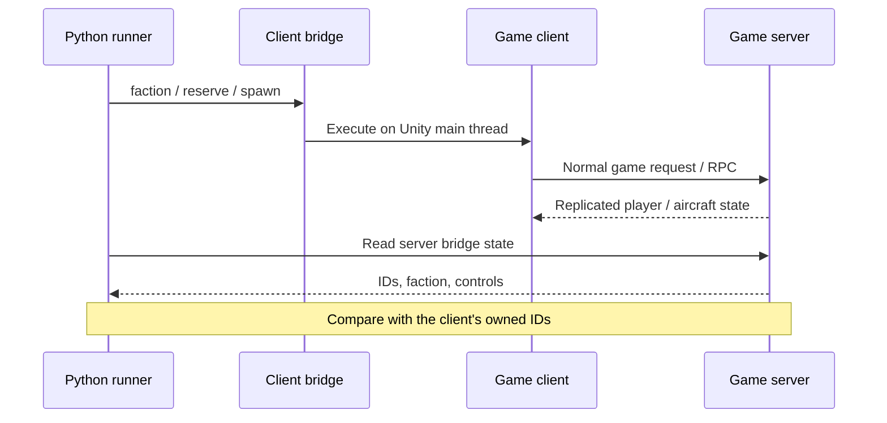

# How to control a test player

**Tell the client what to do. Ask the server whether it happened.**

Each client is a separate Nuclear Option process. A BepInEx 5 plugin provides a
local control interface. Python sends commands there and polls the server's bridge
for the resulting state.



The socket worker parses requests; game methods run on Unity's main thread. Each
request has an ID, token and execution deadline. The runner creates a fresh random
token for each run. This token is separate from the game server password.

Two scoped adapters allow headless UDP connections without retail Steam callbacks
and provide a fallback display name. The server's original authenticator still
checks the join. This does not test Steam authentication or retail-client compatibility.

## Commands

| Command | Target | Arguments / effect |
|---|---|---|
| `status` | Either | Read mission, IDs, aircraft, controls and game errors |
| `host` | Server | `mission`, `port`, optional `password`; UDP multiplayer host |
| `connect` | Client | `port`, optional `password`; join loopback host |
| `disconnect` | Client | Normal game network stop |
| `faction` | Client | `name`; request faction selection |
| `reserve` | Client | Optional `aircraft` key; request eligible reserve airframe |
| `purchase` | Client | `aircraft` key; request purchase (**unverified at runtime**) |
| `spawn` | Client | Optional `aircraft`, `airbase`, `fuel`; owned unarmed aircraft |
| `engine` | Client | `on`; request ignition toggle if needed |
| `controls` | Client | `pitch`, `roll`, `yaw`, `throttle`, `brake`, `seconds` |
| `release-controls` | Client | End input override |

Default reserve selection is deterministic: eligible rank, then aircraft key.
Default spawn chooses an owned airframe and a friendly compatible base. Game
availability and ownership checks still apply. A command reply is not proof of success.

## Aircraft controls

During an active control lease, the bridge replaces the local pilot state's
keyboard/joystick reading with supplied raw values. Input filtering, pilot
simulation, physics and network snapshots keep running. The runner never directly
moves or teleports the aircraft.

Pitch/roll/yaw range from −1 to +1. Throttle/brake range from 0 to 1. Leases last
0.1–60 seconds and target one owned aircraft. Omitted controls are zero: every
command supplies a complete set. Long scripts must renew leases deliberately.

Expiry/release clears the supplied controls and returns to normal input sampling.
If the aircraft disappears, the override stops applying. Lease status reports the
aircraft ID, remaining time and how many times the pilot applied the values.

Replacing input reading also bypasses that layer's UI and pilot-strength gates.
This is a test driver, not a keyboard/menu test or an exact simulation of human
input limitations. Flight and combat need their own runtime scenarios.

## Check the resulting ownership

```json
{
  "target": "server",
  "expect": [
    { "path": "remotePlayers", "equals": 2 },
    {
      "path": "players.1.aircraftNetId",
      "equalsFrom": { "target": "client1", "path": "localPlayerAircraftNetId" }
    }
  ],
  "timeout": 60
}
```

Snapshots sort players by player index. Included scenarios join in a known order.
A selector by network ID will be needed for arbitrary concurrent join patterns.

## Python control

A custom controller can use the runner's interface:

```python
from notestpilot.runner import Bridge

client = Bridge(port=bridge_port, token=run_token)
client.call("controls", {"throttle": 0.7, "brake": 0, "seconds": 10})
state = client.status()
client.call("release-controls")
```

The port/token belong to an explicitly enabled disposable game process. The current
CLI executes whole scenarios and closes its processes afterward. A live dashboard
or route-following bot would use the same interface; neither is implemented yet.
