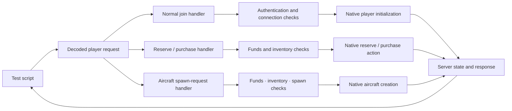

# Testing modes

NOTestPilot currently provides **server simulation testing**. A separate
**player request testing** mode is a possible next step; it is not implemented.
Both are development tests against a disposable dedicated game. Neither mode by
itself proves retail-client or network-transport behavior. There is no `--mode`
flag; current scripts use server simulation.

## Available: server simulation

The script creates ownerless native `Player` records and aircraft in one server
process. It directs tasks through `Session.create()`, `Actor.spawn()`,
`Actor.goto()` and `Actor.attack()`, then checks `Actor.status()` and
`Session.events()`. Cancellation and cleanup use `Actor.cancel()` and
`Actor.remove()`; `Session.quit()` ends the disposable fixture.

The game still performs native flight simulation, aiming helpers, gun firing,
bullet creation, collision, hit registration, damage application, ejection and
aircraft replacement. This makes the mode useful for scripted flight, gun/damage
and lifecycle regressions. It does not establish what a connected player can
request, what the server accepts from that player, or what another client sees.

| Behavior | Server simulation mode |
|---|---|
| Aircraft flight | Runs on the server for the ownerless mock; incoming client flight snapshots and their validation are bypassed. |
| Gun and damage | Uses native server bullet, hit and damage routines. A remote client's hit claim and the server validation of that claim are bypassed. |
| Player entry and economy | Mock identity is created directly. Connected-player join checks, joining funds, faction allocations, reservations, purchases and ordinary aircraft request checks are bypassed. |
| Inventory and persistence | Faction save restoration and saving faction data are bypassed. |
| Ejection and lifecycle | Native server ejection/replacement behavior is exercised directly; the client ejection request and its checks are bypassed. |
| Replication | No connected client receives state. Snapshot timing, serialization, delivery, and remote observation are untested. |
| Rewards and score | Native reward/score math is retained, but kill/score assertions are unverified and there is no client recipient for reward displays. Retaining that math does not test normal purchases, lifecycle requests, kill attribution or kill-score outcomes. |

Resource use and actor counts describe this server-side fixture. They are not a
measurement of connected-player cost or capacity.

## Proposed: player request testing

This mode is not implemented and is not part of current test coverage. Its goal
would be to pass a coherent mock connection through the normal player-request
path, after the transport has decoded a request:

The fixture would need a coherent mock connection and authentication data, plus
normal funds, reserve and inventory state. Tests would then exercise ordinary
join, purchase, and spawn request handlers, including rejection cases. These are
conceptual handler boundaries, not claims that a particular implementation or
method name has been selected. The entry boundary is after request decoding: this
proposal does not provide a socket, packet decoder, real account, or client.

Player-request tests would complement server simulation tests rather than replace
them. They could validate server-side request decisions, but would still not
prove retail login, client flight simulation, packet transport, replication to a
second process, or rendering. Testing client-owned flight would require a separate
client-simulation adapter and its own evidence.
