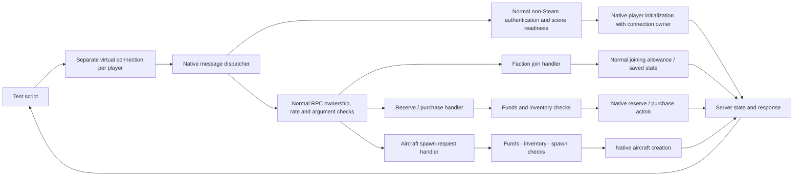

# Testing modes

NOTestPilot currently provides **server simulation testing**. A separate
**player request testing** mode is a possible next step; it is not implemented.
Both are development tests against a disposable dedicated game. Neither mode by
itself proves retail-client or network-transport behavior. There is no `--mode`
flag; current scripts use server simulation.

## Available: server simulation

The script creates ownerless native `Player` records and aircraft in one server
process. It directs tasks through `Session.create()`, `Actor.spawn()`,
`Actor.goto()` and `Actor.attack()`, then checks `Actor.status()` and
`Session.events()`. Cancellation and cleanup use `Actor.cancel()` and
`Actor.remove()`; `Session.quit()` ends the disposable fixture.

The game still performs native flight simulation, aiming helpers, gun firing,
bullet creation, collision, hit registration, damage application, ejection and
aircraft replacement. This makes the mode useful for scripted flight, gun/damage
and lifecycle regressions. It does not establish what a connected player can
request, what the server accepts from that player, or what another client sees.

| Behavior | Server simulation mode |
|---|---|
| Aircraft flight | Runs on the server for the ownerless mock; incoming client flight snapshots and their validation are bypassed. |
| Gun and damage | Uses native server bullet, hit and damage routines. A remote client's hit claim and the server validation of that claim are bypassed. |
| Player entry and economy | Mock identity is created directly. Connected-player join checks, joining funds, faction allocations, reservations, purchases and ordinary aircraft request checks are bypassed. |
| Inventory and persistence | Faction save restoration and saving faction data are bypassed. |
| Ejection and lifecycle | Native server ejection/replacement behavior is exercised directly; the client ejection request and its checks are bypassed. |
| Replication | No connected client receives state. Snapshot timing, serialization, delivery, and remote observation are untested. |
| Rewards and score | Native reward/score math is retained, but kill/score assertions are unverified and there is no client recipient for reward displays. Retaining that math does not test normal purchases, lifecycle requests, kill attribution or kill-score outcomes. |

Resource use and actor counts describe this server-side fixture. They are not a
measurement of connected-player cost or capacity.

## Proposed: player request testing

This mode is not implemented and is not part of current test coverage. Its goal
is to give each test player a connection context and send native game messages
through the normal server dispatcher. Source inspection found a route that keeps
authentication, sender ownership, argument decoding and per-player RPC rate
checks. It needs a game runtime proof before it can be called working:

The virtual connection would carry native messages in memory through the same
dispatcher and decoder used for incoming messages. This bypasses sockets and UDP
delivery, rather than authentication or the normal request checks. Source indicates
the game's existing non-Steam path can supply authentication and per-player
saved-state objects; the proposal does not invent Steam identities or use real
accounts.

Calling a purchase method directly is insufficient: it skips framework ownership
and rate checks, and some public command wrappers choose the host sender. The
adapter must bind each request to its own native connection and retain native
errors, replies and notices. No rejected request may fall back to direct aircraft
creation, extra funds or server flight control.

### First proof

1. Complete native non-Steam authentication and scene readiness for one virtual
   connection; verify the player is owned by that connection.
2. Join a faction through its normal request and observe the ordinary allowance,
   faction funds and owned-airframe state.
3. Reject an unaffordable purchase with funds and inventory unchanged; accept an
   affordable purchase with the exact native cost deducted and inventory credited.
4. Request an airbase spawn using that inventory. Verify normal eligibility,
   resource use and player/aircraft ownership; reject an unowned or forbidden spawn.
5. Reject a request from the wrong owner and verify native rate limiting.
6. Disconnect and verify native player, connection and observer cleanup.

These are acceptance criteria, not test results. Private framework bindings,
outgoing-message handling and native saved-state behavior remain unverified in a
running fixture. Rejoining and persistence need their own later checks.

### Shared tooling, different actions

Both modes can share the script transport, observations, bounded waits, native
event evidence and immutable runtime/player/aircraft handles. Lost replies must
remain uncertain; spending or spawning must never be retried automatically.

The request mode needs a distinct player handle with join, purchase, reserve and
airbase-spawn operations. Existing free-position `Actor.spawn()`, `goto()` and
server `attack()` must not silently become available to request players. Keep
the adapters separate until both have native evidence; extract shared code only
where its behavior is actually the same.

Player-request tests would complement server simulation tests rather than replace
them. They could validate server-side request decisions, but would still not
prove retail login, client flight simulation, packet transport, replication to a
second process, or rendering. Testing client-owned flight would require a separate
client-simulation adapter and its own evidence.
