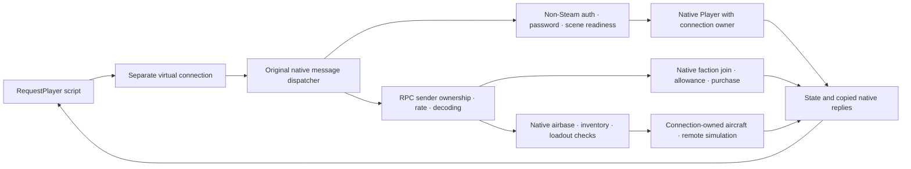

# Testing modes

NOTestPilot implements two complementary modes in one disposable dedicated game.
Use Server simulation for scripted flight and combat, and Player requests for
native entry, economy and spawn decisions. Neither establishes retail-client or
socket-transport behavior.

| Behavior | Server simulation | Player requests |
|---|---|---|
| Player identity | Ownerless native mock Player | Native non-host Player owned by its virtual connection |
| Authentication | Bypassed for mocks | Original non-Steam authentication and password exchange |
| Flight | Native physics runs on the server | Normal remote simulation retained; client physics is not supplied |
| Gun and damage | Native server firing, bullets, hits and damage; remote hit-claim validation bypassed | Client firing/hit requests are not implemented |
| Economy and spawn | Direct fixture creation bypasses allowance, inventory and request checks | Original faction allowance, purchase and validated airbase spawn requests |
| Framework guards | Mock control handle guards | Native sender ownership, RPC rate limits and argument decoding, plus immutable control handles |
| Lifecycle | Script cancellation, ejection/replacement and owned mock cleanup | Native disconnect, owned-identity and observer cleanup |
| Networking | No mock peer | Copied native messages delivered in memory; sockets and remote rendering untested |

## Server simulation

`Session.create()` creates a mock identity. `Actor.spawn()`, `goto()` and `attack()`
assign its aircraft pose and explicit tasks. The adapter uses selected native
steering, ballistic and firing helpers; it does not install the ordinary NPC
brain. Native flight, gun/damage, lifecycle and repeated navigation fixtures pass.
Native reward math is retained, but kill-score assertions remain unverified.
Mock faction save restoration/saving and connected-player request checks are
bypassed. Resource use measures this fixture, not connected-player capacity.

## Player requests

`Session.join_request_player(name, password)` creates a separate virtual endpoint
and completes the game's original authentication and scene-readiness path. It
does not stamp successful authentication or invent Steam identities.



Requests are serialized and submitted with their own native sender to the
registered dispatcher. Direct gameplay calls and host-sender shortcuts are not
used. A rejection never falls back to free creation, extra funds or server flight
control. Native errors and replies remain visible.

The separate `RequestPlayer` handle provides `join_faction()`,
`purchase_airframe()`, `request_spawn()`, `status()`, `packets()` and
`disconnect()`. Choose faction, airbase and affordable aircraft from live
mission metadata; omitting a loadout uses the aircraft's native default. Status
does not expose a loadout-preset or weapon-mount catalog. Reservations are not
exposed by this API. A spawn request
returning an allowed native result may still be waiting for a hangar; require its
exact correlated receipt and actual linked aircraft before declaring success.
Rebind explicitly after the aircraft generation changes.

Native game checks passed authentication and readiness, ordinary allowance,
unaffordable purchase rejection, exact-cost inventory credit, unowned and
foreign-base spawn rejection, and an owned aircraft with normal remote authority.
A two-peer fixture passed wrong-owner rejection, native rate limiting and refill,
independent sender state and complete disconnect cleanup. The public two-player
purchase/spawn example also passed its full native checks. Rejoining, persistence,
other missions and loadouts need further checks.

### Enable and run

Use the reviewed runtime and an already running disposable mission, as described
in the [README setup](../README.md#build-and-check). Set
`NOTESTPILOT_PLAYER_REQUESTS=1` on the game process. Supply the Python script's
private control port/token and explicit `NOTESTPILOT_PASSWORD` matching the lab
password, then run:

```sh
uv run python examples/player_requests.py
```

The example checks two distinct identities, independent allowance and purchases,
correlated owned spawns and cleanup. It fails on uncertain outcomes and cleans
only its own connections. Native guard diagnostics require the additional
`NOTESTPILOT_REQUEST_PROBES=1` opt-in; they are bounded read-only queries, not a
general RPC interface.

### Evidence and cleanup

`packets()` consumes bounded chunks of copied native outgoing messages. Keep raw
packet records in private diagnostic storage. Capture the current sent-sequence
boundary and drain through it; new output can continue, so an empty queue is not
an acceptance condition. A lost response or sequence gap invalidates that
connection's packet evidence. Native reply observation happens before consumer
drains and does not remove packets.

Handles bind runtime, connection, player and aircraft generation. An uncertain
join can be inspected through its exact creation receipt for cleanup; never
adopt a same-name foreign player or replay a mutation. Spending and spawning are
issued once. Verify native disconnected membership, zero owned/visible identities
and complete cleanup rather than relying only on a disconnected label.

Player requests retains native per-player saved-state contexts, but reconnect
persistence is unverified. It does not provide client-owned flight snapshots,
hit claims, UDP delivery, retail Steam authentication, replication to another
process or rendering. Those require separate adapters and evidence.
